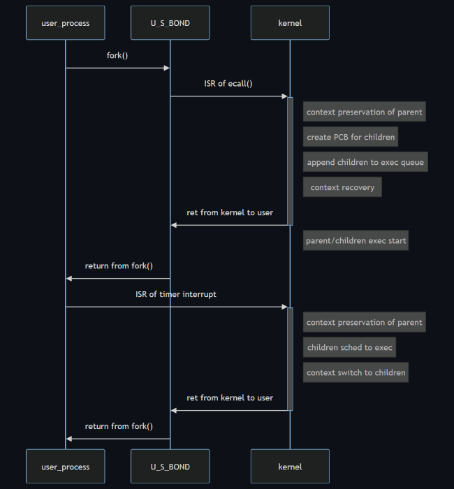

# Assignment 2 - Implementation of System Calls and Processes

> Author: [Qiu Kunyuan / 11913019](mailto://11913019@mail.sustech.edu.cn)

1. [Issue 1](#issue-1)
   1. [Problem 1](#problem-1)
   2. [Problem 2](#problem-2)
2. [Issue 2](#issue-2)
3. [Issue 3](#issue-3)
   1. [Problem 1: `fork()`](#problem-1-fork)
   2. [Problem 2: `exit()`](#problem-2-exit)

## Issue 1

### Problem 1

the *three easy pieces* of operating system is its three crucial concepts: **virtualization**, **concurrency**, and **persistence**. The design and evolution of operating systems focus on the reasonable virtualization of hardware resources, concurrent execution and seamless switching between multiple tasks, and persistent storage of data.

To implement these key features above, there are 3 corresponding solution:

- **System call**s and **Hardware Abstraction Layer**s separates the user operations and hardware manipulations into physically isolated HW priviledge levels, with corresponding HW access controls. Therefore, the only access of user programs to hardware resources is managed system call instructions.
- **Process**es are adopted to organize multiple tasks to be executed. Therefore, appropriate scheduling methods can be applied to dispatch the limited hardware resources reasonably.
- **File system** is specifically designed to provide managed, organized access to non-volatile storage media.

### Problem 2

- The **virtualization** part maps to Part.IV, the memory management, which focuses on the virtualization of memory. The Chapter 5 in Part.I also discusses the virtualization of CPU, by the means of CPU scheduling.
- The **concurrency** parts maps to Part.II, Part.III. These 2 parts discuss on the comprehensive aspects of process management, scheduling and synchronization.
- The **persistence** part maps to Part.V and Part.VI. Among the 2 parts, the organization of mass-storage structures and file systems are researched.

## Issue 2

During context switch, the registers vector (all user registers, stack and frame pointers, and certain control registers) of the previous process is pushed into kernel stack frame by corresponding `save` subroutine in assembly.

Then the kernel stack frame of the next process is popped to registers by similar assembly subroutine (reversing `save` into `load`). In most implementation of `switch()` subroutine, the program counter of the next process is popped directly into corresponding register, enabling the execution of the next process by directly invoking `ret`.

Finally, the next process starts its execution from the recovered stack and frame pointers. In most cases, the context switching is triggered by timer interruption.

## Issue 3

### Problem 1: `fork()`

When the `fork()` system call is invoked by the user process, the `ecall` instruction triggers an internal interrupt (trap). Since the ISR corresponding to the interrupt locates at the head of the IVT (much unlike bare-metal embedded systems, which utilizes most of the IVT), there is only one ISR for the switching of the context and the dispatching of the interrupt.

After the execution flow enters the interrupt dispatch subroutine `trap.c`, the kernel function `do_fork()` is invoked by indexing in the syscall table with the corresponding system call number.

In the `do_fork()` function, the kernel stack and the PCB of the parent process is firstly copied to these of the children (after necessary allocations), and some elements of the PCB of the children are then configured to differ from the parent, such as the PID=PID+1, and the return value from last `ret` is 0. Once the PCB of the children is initialized, the children is enqueued to the exec queue.

In preemptive scheduling system, the execution of both the parent and the children are splitted into time slots. When the timer interrupt invokes the scheduler, the context of the previous process is pushed into its kernel stack, and the CPU then switches to the next process by popping from kernel stack to the register vector.

### Problem 2: `exit()`

1. The files used by the exiting process is released.
2. If there were subprocesses belong to the exiting process, their parent are set to `init` by the `exit()`, eliminating the orphan process.
3. Invoke the `wakeup()` to wakeup the parent by `SIGCHLD()` signal.
4. Set the status of the children to `ZOMBIE`, implying the scheduler not to run the children.
5. The cleanup are done by wait() in parent or `init`, and the status of the children are set to `UNUSED` only after all cleanup are done.